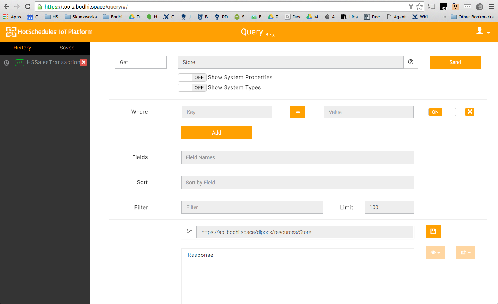
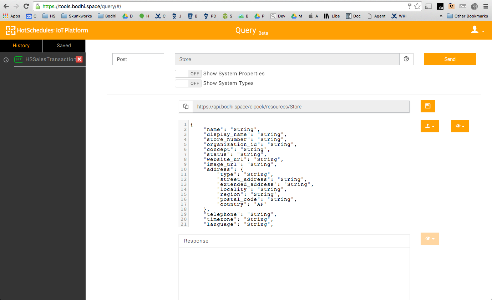
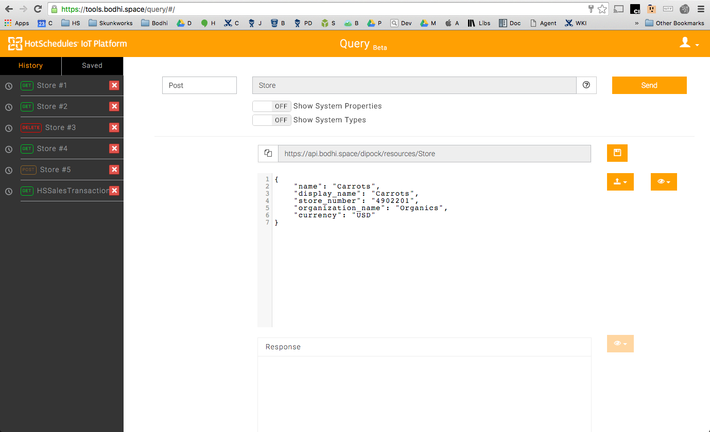
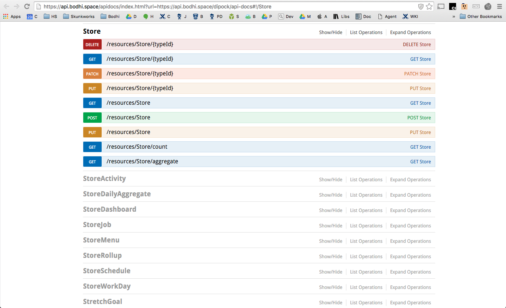

# Platform Workshop #10

## HS Labor Integration

This documentation is intended for developers looking to integrate to the HS IoT Platform with the purpose of building a bi-directional integration into their point of sale systems. 

While the HS IoT Platform exposes many API's and can be accessed through several means, this documentation focuses on two specific use cases using the Platform API

1. integration to the general or canonical data types
2. integration to the data types required by HotSchedules Labor

If you only want to integrate to the HotSchedules Labor product then you only need to use the data types for HotSchedules Labor. If you want to use the platform for other purposes or applications then you need to use the canonical data structures.  
If you want to use the platform and labor - then you need to write to both data structures.


- [Prerequisites](#prereq)
- [The API in 2 minutes](#api)
- [The Query tool](#browser)
- [Get data](#get)
- [Test the query](#query)
- [Post data](#post)
- [Dictionary of types](#dictionary)
- [HS Labor Data](#labour) 
- [Canonical Data](#canonical)


## <a name="prereq">Prerequisites</a>

To access the Platform API and execute the queries you will need the following:

1. A Platform account 
2. Code or shell script that can make REST requests to the Platform API.


## <a name="api">The API in 2 minutes</a>


The Platform API consists of four parts

- host
- namespace
- resource
- query

The **host** is the public URL of the Platform Cloud. This is always <https://api.bodhi.space/>. Note all requests are made over **HTTPS**

The **namespace** is the name of your Platform account or “tenant”. In this document we will assume our namespace is called “organics” - an account that exists for the organic chain of cafes located in the San Francisco Bay Area.

The **resource** is the name of the data structure (or “type”) that you want to access.  An example or a resource is SalesItem or SalesTransaction. The resources is always prefixed with the '**resources/**' keyword.

The **query** is the typical type of query that you would make in the browser. It can be a simple request to get all results or a limited set of results using a where clause - or can be more complex and provide aggregated results. 

The **results** returned from a query, known as documents - and are returned in JSON notation.

A request is constructed like this

````
<host>/<namespace>/resources/<resource>/query
````

Example 1: A query on the Organics account with no query:

````
https://api.bodhi.space/organics/resources/Store
````

Example 2: A query on the Organics account with a query:

````
https://api.bodhi.space/organics/resources/Store?where={'display_name': { $eq: 'Carrots' }}
````


API documentation for all Platform types - including any that you have created yourself, can be located at <https://api.Platform.space/apidocs/index.html>


## <a name="browser">The Query tool</a>

To get familiar with the API, first log into **https://tools.bodhi.space/query/**. This will ensure that any REST queries you make via the browser will be authenticated and correctly formatted.


### <a name="get">GET Data</a>

In the Bodhi Query tool, enter the name of the data type you want to access in the first input field. In this case you want to fetch all stores from the data type called 'Store' - so enter **Store** in the input box.



Before you press Send to execute the query, look at the middle of the page. You can see that the Query tool has built up the query you are about to send to the Platform API. It should look something like this:

````
https://api.bodhi.space/organics/resources/Store
````

Press Send to Execute the query. If you have any stores populated in your account you should see some data.


### <a name="query">Test the query in a browser tab</a>

Press the clipboard icon in the middle of the page to copy the query to your clipboard. 

Open a new browser tab. Paste the query from the clipboard buffer into the address bar. Hit return to execute the query. you should see the same results in your browser window. You now know how to make and structure the REST requests against the platform API.


### <a name="post">POST Data</a>

To post data to the platform API go back to the Platform Query tool. Click the drop down option (marked GET) to change the operation to POST. 



The query tool will create a pre-populated JSON structure for you, so you can write to the data type. Go ahead and populate the data structure. Note: you don't have to populate all the properties - but some are mandatory. If you just want to save time, the following example is a bare minimum that you can POST.  You can copy the content and post this instead.


````
{
	"name": "Carrots",
	"display_name": "Carrots",
	"store_number": "4902201",
	"organization_name": "Organics",
	"currency": "USD"
}
````



When you are ready, press Send to post the data to the platform API. The Platform should respond with a 204 saying the data was created. If you made any syntax errors you will be informed and the post will fail.


### <a name="dictionary">Dictionary of types</a>

Before looking at the data types you need to populate or plan to query from the platform, you should take a look at the dictionary of data types located here **https://api.bodhi.space/apidocs/index.html**

Note: if you want to access the documentation without having to log in again, you can do so by keeping the Query tool open in one tab (your authenticated session open) and opening a new tabe and entering the following URL in the browser on one line:

````
https://api.bodhi.space/apidocs/index.html?url=
https://api.bodhi.space/organics/api-docs#!/Store
````

This will open the browser and take you to the Store data definition as shown in the diagram below.





You can interact with the API in the same way that you tested the API using the query tool.


## <a name="labour">HS Labor Data</a>

To push data to HotSchedules the following data types need to be populated

Seed data (changes infrequently) 
- HSEmployee   
- HSEmployeePosition    
- HSRevenueCenter 
- HSSalesCategory 
- HSSalesCategoryRollup 
- HSStoreJob  

Transactional data (changes on a per day basis)
* HSSalesTransaction 
* HSSchedule 
* HSTimecard 


## <a name="canonical">Canonical Data</a>
 